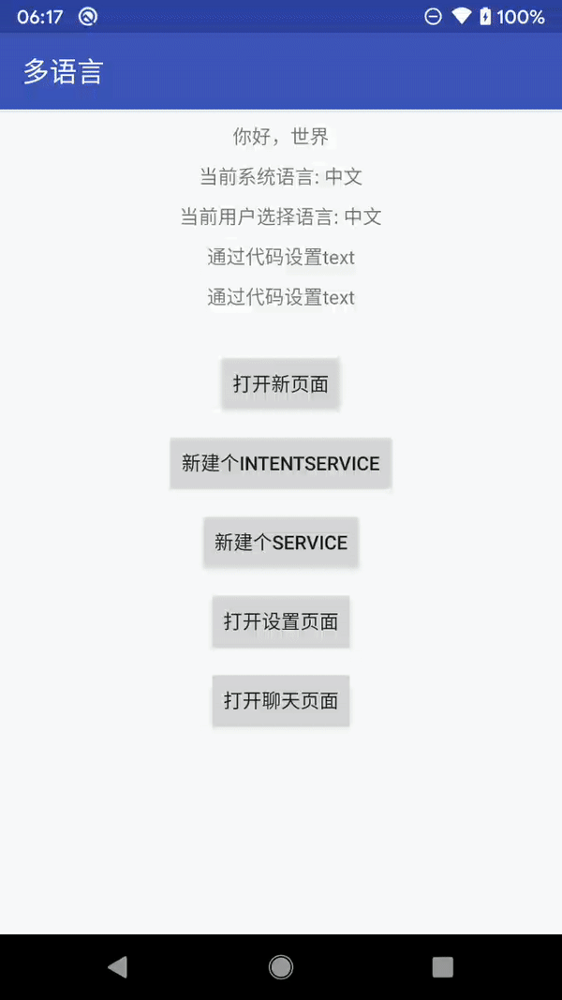

[](https://jitpack.io/#peihua8858/MultiLanguage)
### Android 多语言切换（兼容8.0+） 1.0版本，一句代码完成多语言切换，现在支持第三方包里多语言切换（前提是有对应的语言资源）


### **1.0.0版本**
1.0.0版本使用Transform API
编译插桩的方式来实现```Activity```,```Service```
的```attachBaseContext```方法覆盖重写（具体请看[plugin](./plugin)下代码）
### **1.1.0版本**
1.1.0版本支持增量编译
- 支持AndroidX
- 支持kotlin
- 解决appcompat 1.2.0切换语言无效的问题
- **不支持Instant Run**

### **使用**

- 引入gradle plugin
### 添加存储库
```
allprojects {
		repositories {
			...
			maven { url 'https://jitpack.io' }
		}
	}
```
### 添加依赖
 ```
   dependencies {
            implementation 'com.github.peihua8858.MultiLanguage:plugin:1.0.1'
   	}
```
- app ```buidle.gradle``` 文件引入plugin
    ```
    apply plugin: 'multi-languages'
    ```
    插件配置
    ```
    multiLanguages {
        //可以配置开关来控制是否重写(插件会耗时一部分的编译时间)
        enable = true
        //配置强制重写attachBaseContext方法类（如果类里已经重写了attachBaseContext方法，默认不会覆盖重写）
        overwriteClass = ["com.fz.multilanguages.BaseActivity"] 
    }
    ```
- ### 添加项目级依赖
```
   dependencies {
            implementation 'com.github.peihua8858.MultiLanguage:languages:1.0.1'
```

- application init
```
   public class MultiLanguagesApp extends Application {
    @Override
    protected void attachBaseContext(Context base) {
        //第一次进入app时保存系统选择语言(为了选择随系统语言时使用，如果不保存，切换语言后就拿不到了）
        LocalManageUtil.saveSystemCurrentLanguage(base);
        super.attachBaseContext(MultiLanguage.changeLanguage(base));
    }

    @Override
    public void onConfigurationChanged(Configuration newConfig) {
        super.onConfigurationChanged(newConfig);
        //用户在系统设置页面切换语言时保存系统选择语言(为了选择随系统语言时使用，如果不保存，切换语言后就拿不到了）
        LocalManageUtil.saveSystemCurrentLanguage(getApplicationContext(), newConfig);
        MultiLanguage.onConfigurationChanged(getApplicationContext());
    }

    @Override
    public void onCreate() {
        super.onCreate();
        MultiLanguage.init(new LanguageLocalListener() {
            @Override
            public Locale getSetLanguageLocale(Context context) {
                //返回自己本地保存选择的语言设置
                return LocalManageUtil.getSetLanguageLocale(context);
            }
        });
    }
    }
```
    [LocalManageUtil](./app/src/main/java/com/fz/multilanguages/demo/utils/LocalManageUtil.java)里做的是保存选择的语言设置


以上就完成了初始化了，

----

### **```attachBaseContext```方法已被重写过？**
在v1.0.0版本去除了强制重写```attachBaseContext```方法的逻辑，

- 如果需要修改该类则在该类原来重写了该方法需要手动加上

    ``` super.attachBaseContext(MultiLanguage.changeLanguage(newBase));```

- 如果需要强制重写可以在在插件配置里```overwriteClass```里加上全路径包名后插件覆盖重写 

```
        multiLanguages {
        enable = true
        overwriteClass = ["com.fz.multilanguages.BaseActivity"]
        }
```

### **locales列表**

https://github.com/championswimmer/android-locales


----

